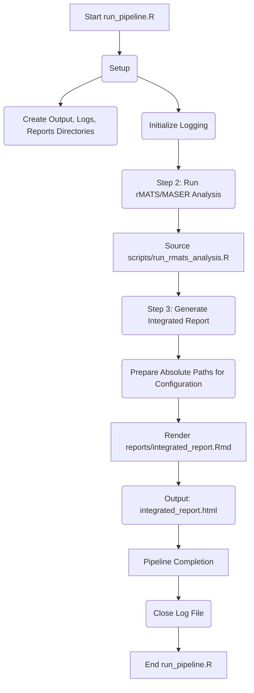

```mermaid
graph TD
    A[Start run_pipeline.R] --> B(Setup);
    B --> B1(Create Output, Logs, Reports Directories);
    B --> B2(Initialize Logging);
    
    B2 --> C(Step 2: Run rMATS/MASER Analysis);
    C --> C1[Source scripts/run_rmats_analysis.R];
    
    C1 --> D(Step 3: Generate Integrated Report);
    D --> D1(Prepare Absolute Paths for Configuration);
    D1 --> D2[Render reports/integrated_report.Rmd];
    D2 --> D3(Output: integrated_report.html);
    
    D3 --> E[Pipeline Completion];
    E --> F(Close Log File);
    F --> G[End run_pipeline.R];


```